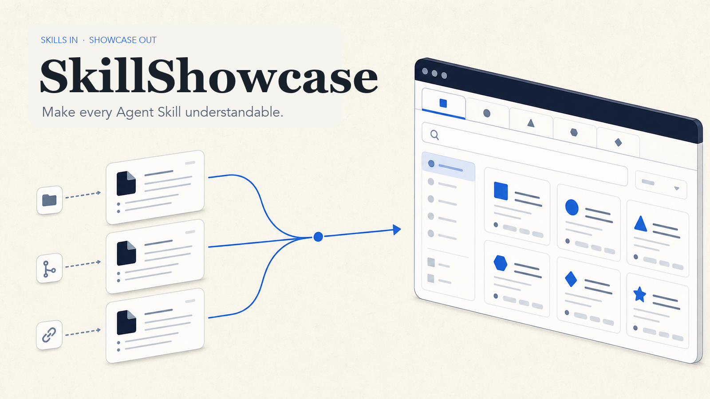
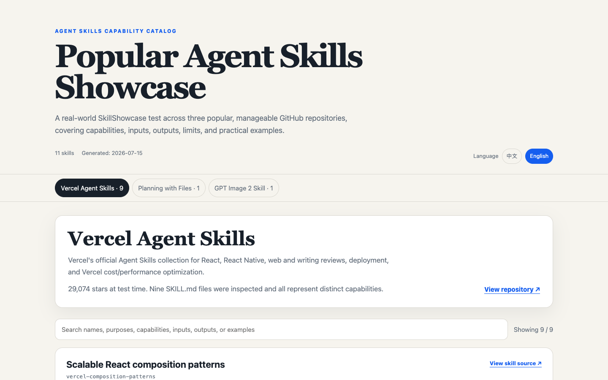

<p align="center">
  
</p>

<p align="center">
  <strong>Turn Agent Skill links into a clear, searchable showcase.</strong><br>
  Make every Agent Skill understandable.
</p>

<p align="center">
  <a href="LICENSE"></a>
  
  
</p>

<p align="center">
  <a href="README.zh-CN.md">中文</a> ·
  <a href="https://hskelp9527-pixel.github.io/SkillShowcase/">Live showcase</a> ·
  <a href="examples/popular-skills.bilingual.html">Bilingual example</a> ·
  <a href="examples/skill-showcase.example.html">Minimal example</a>
</p>

## Skills are written for agents. People still need to understand them.

A repository may contain one Skill or hundreds. Its README explains the project, while the details people actually need are scattered across `SKILL.md` files: what each Skill does, what to provide, what it returns, where it stops, and how to ask for it.

**SkillShowcase turns those sources into one shareable HTML page.** Give an agent one or more Skill links; receive a searchable gallery written for humans, with grounded explanations and realistic usage examples.

<p align="center">
  <a href="https://hskelp9527-pixel.github.io/SkillShowcase/">
    
  </a>
</p>

## What you get

| From the source | In the showcase |
|---|---|
| Repository and `SKILL.md` links | One project tab per repository or collection |
| Skill instructions and declared behavior | Plain-language purpose and capability summaries |
| Required context and constraints | Minimum input, optional input, expected output, and limitations |
| Examples and source-grounded inference | Realistic requests users can try |
| Translation or runtime mirrors | One logical entry with variants listed, not duplicate cards |

The result is a responsive, self-contained HTML file with search and source links. It needs no framework, database, or backend.

## Ask once

Install the Skill, then send links in natural language:

```text
Use $agent-skill-showcase to inspect these repositories and create a bilingual HTML showcase.
Explain every skill's purpose, inputs, outputs, limitations, and add two realistic example requests.

https://github.com/owner/repo-one
https://github.com/owner/repo-two
```

SkillShowcase follows the conversation language by default:

| Your request | Generated page |
|---|---|
| Chinese | Chinese only (`zh-CN`) |
| English | English only (`en`) |
| Explicitly asks for both | One page with a Chinese / English switch (`both`) |

## From links to showcase

1. **Discover** — read repository documentation and every discoverable `SKILL.md`.
2. **Explain** — describe capabilities, inputs, outputs, limitations, and examples without copying technical noise.
3. **Structure** — write a source-grounded catalog and group translation/runtime variants without hiding distinct skills.
4. **Render and verify** — build the static page, check source coverage, and test tabs, search, language behavior, and mobile layout when browser tools are available.

Remote scripts are never executed. Repository content is treated as untrusted source material.

## Real-world proof

The included showcase was produced from public Skill repositories rather than hand-written demo cards:

| Source | Files inspected | Logical entries shown |
|---|---:|---:|
| [Vercel Agent Skills](https://github.com/vercel-labs/agent-skills) | 9 | 9 |
| [Planning with Files](https://github.com/OthmanAdi/planning-with-files) | 17 | 1, with editions grouped |
| [GPT Image 2 Skill](https://github.com/wuyoscar/GPT-Image2-Skill) | 1 | 1 |
| **Total** | **27** | **11** |

Open the [live showcase](https://hskelp9527-pixel.github.io/SkillShowcase/) or read the [test report](reports/real-world-test-2026-07-15.md).

## Install

Clone or download this repository, then copy or link it into your Agent Skill directory:

```bash
git clone https://github.com/hskelp9527-pixel/SkillShowcase.git
mkdir -p ~/.agents/skills
cp -R SkillShowcase ~/.agents/skills/agent-skill-showcase
```

- **Codex:** `~/.codex/skills/agent-skill-showcase`
- **Claude Code:** `~/.claude/skills/agent-skill-showcase`
- **Other compatible runtimes:** use their configured Agent Skills directory

The canonical entrypoint is [`SKILL.md`](SKILL.md). A full Chinese maintenance edition is available at [`docs/SKILL.zh-CN.md`](docs/SKILL.zh-CN.md).

## Render an existing catalog

The deterministic renderer uses only the Python standard library:

```bash
python3 scripts/render_showcase.py examples/catalog.example.json \
  --output examples/skill-showcase.example.html \
  --language both
```

See [`references/catalog-contract.md`](references/catalog-contract.md) for the catalog schema.

## Scope and trust

SkillShowcase does **not** install, execute, rank, endorse, or security-audit the Skills it reads. A showcase explains declared capabilities; it is not proof that a third-party Skill is safe or production-ready. See [SECURITY.md](SECURITY.md) for the trust boundary.

## Project map

```text
SkillShowcase/
├── SKILL.md                       # Canonical Agent Skill entrypoint
├── docs/SKILL.zh-CN.md            # Full Chinese maintenance edition
├── scripts/render_showcase.py     # Deterministic HTML renderer
├── references/                    # Research, data, and HTML contracts
├── examples/                      # Catalogs and generated showcases
├── tests/                         # Renderer tests
└── agents/interface.yaml          # Runtime-facing metadata
```

## Quality checks

```bash
python3 -m unittest discover -s tests -v
```

The current release passes renderer tests, Skill validation, trigger evaluation, resource-boundary checks, and desktop/mobile browser QA. Details are recorded in the [real-world test report](reports/real-world-test-2026-07-15.md).

## Contributing

Issues and pull requests are welcome. Keep the promise focused: complete source coverage, explanations people can understand, examples they can use, and a page worth sharing. See [CONTRIBUTING.md](CONTRIBUTING.md).

If SkillShowcase makes a Skill repository easier to understand, consider starring the project or sharing the generated page with its maintainers.

## License

[MIT](LICENSE)
